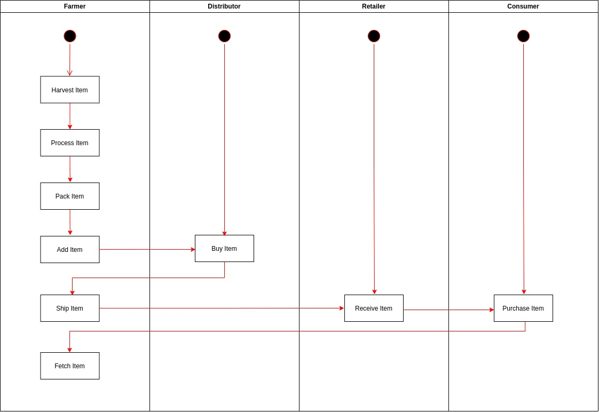
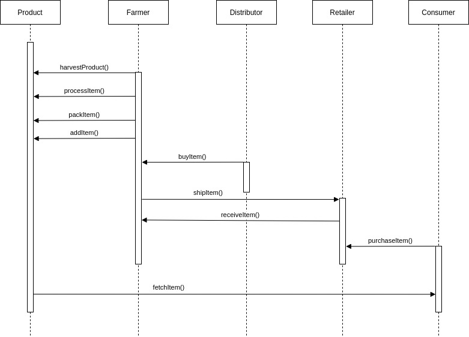
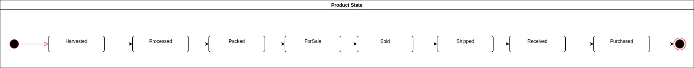
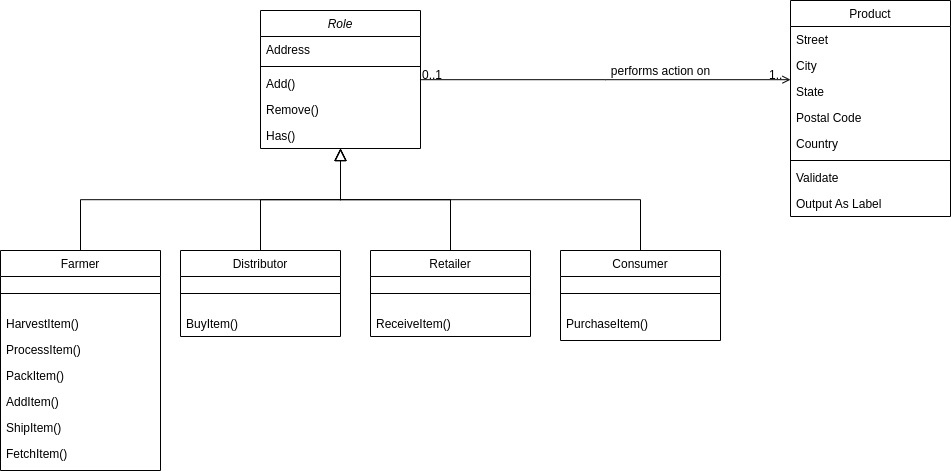

# Contract Addresses 
Farmer Contract: [0x12bc5d916b318426f1c6b0eac8d390f5cc2fbedd](https://goerli.etherscan.io/address/0x12bc5d916b318426f1c6b0eac8d390f5cc2fbedd)

Distributor Contract: [0x3465988940fcfad5a208a005e01e9f445f4101df](https://goerli.etherscan.io/address/0x3465988940fcfad5a208a005e01e9f445f4101df)

Retailer Contract: [0xbec6f7edd88b1571d820dd80e5f0e7700e869934](https://goerli.etherscan.io/address/0xbec6f7edd88b1571d820dd80e5f0e7700e869934)

Consumer Contract: [0x2172d4d373b0d8a44977d9368ef2253495498db8](https://goerli.etherscan.io/address/0x2172d4d373b0d8a44977d9368ef2253495498db8)

SupplyChain Contract: [0x59098ccf9c6a68d095dd3f477058f77130a1ce3c](https://goerli.etherscan.io/address/0x59098ccf9c6a68d095dd3f477058f77130a1ce3c)

# Libraries used
The [Role library](./project-6/contracts/coffeeaccesscontrol/Roles.sol) was used.

# Program version
Node Version: v19.1.0

Truffle Version: v4.1.14

Web3 Version: v1.0.0

# UML Documents
Activity Diagram

Sequence Diagram

State Diagram

Class Diagram

